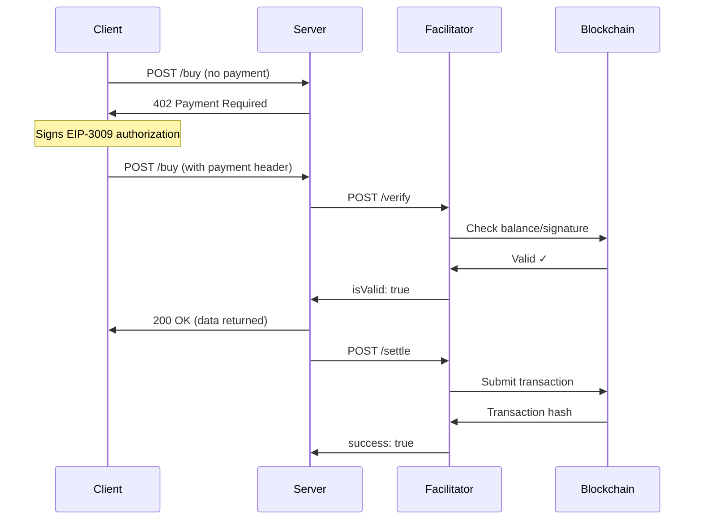

## What is a Facilitator?

Think of a facilitator as your **payment assistant** - it sits between clients and servers, verifying payments and settling them on-chain so you don't have to deal with blockchain nodes, gas fees, or settlement complexity.

**The simple version:** Clients sign payments, facilitators verify them and post them to the blockchain. Everyone's happy.

## Why Use a Facilitator?

<CardGroup cols={2}>
  <Card title="Zero Blockchain Hassle" icon="wand-magic-sparkles">
    No need to run nodes, manage RPC endpoints, or worry about gas prices
  </Card>
  <Card title="Instant Verification" icon="bolt">
    Check if payments are valid in milliseconds without waiting for blocks
  </Card>
  <Card title="Standardized Flow" icon="arrows-spin">
    Consistent verification and settlement across all x402 implementations
  </Card>
  <Card title="No Custody Risk" icon="shield-check">
    Facilitators never hold your funds - they just execute signed authorizations
  </Card>
</CardGroup>

## How It Works

The facilitator handles two critical jobs in the x402 payment flow:

<Steps>
  <Step title="Payment Verification">
    Client sends a signed payment. Facilitator checks:
    - Is the signature valid?
    - Does the amount match what's required?
    - Has this nonce been used before?
    - Is there enough balance?
  </Step>

  <Step title="On-Chain Settlement">
    After verification, facilitator submits the payment to the blockchain:
    - Executes the EIP-3009 `transferWithAuthorization`
    - Pays the gas fees (not you!)
    - Returns transaction confirmation
  </Step>
</Steps>

## The 402.cat Facilitator

We've launched our own facilitator built in Rust with **x402-rs**. It's fast, reliable, and handles all the payment complexity for you.

### Endpoints

Our facilitator exposes these HTTP endpoints:

| Endpoint | Method | Purpose |
|----------|--------|---------|
| `/verify` | POST | Verify a payment signature without settling |
| `/settle` | POST | Verify and settle a payment on-chain |
| `/health` | GET | Check if facilitator is healthy |
| `/supported` | GET | List supported networks and tokens |

### Example: Verifying a Payment

```typescript
POST https://facilitator.402.cat/verify
Content-Type: application/json

{
  "version": 2,
  "network": "eip155:84532",
  "authorization": {
    "from": "0xUserWallet...",
    "to": "0xRecipient...",
    "value": "100000",  // $0.10 USDC
    "validAfter": 0,
    "validBefore": "115792089...",
    "nonce": "0xUnique...",
    "v": 27,
    "r": "0x...",
    "s": "0x..."
  }
}
```

**Response (Valid):**
```json
{
  "isValid": true,
  "payer": "0xUserWallet..."
}
```

**Response (Invalid):**
```json
{
  "isValid": false,
  "invalidReason": "INSUFFICIENT_BALANCE",
  "invalidReasonDetails": "Account balance is 0.05 USDC, required 0.10 USDC",
  "payer": "0xUserWallet..."
}
```

### Example: Settling a Payment

```typescript
POST https://facilitator.402.cat/settle
Content-Type: application/json

{
  "version": 2,
  "network": "eip155:84532",
  "authorization": {
    // ... same payment structure as verify
  }
}
```

**Response (Success):**
```json
{
  "success": true,
  "network": "eip155:84532",
  "transaction": "0xTransactionHash...",
  "payer": "0xUserWallet..."
}
```

**Response (Failure):**
```json
{
  "success": false,
  "network": "eip155:84532",
  "transaction": "",
  "errorReason": "INVALID_SIGNATURE",
  "errorReasonDetails": "Signature verification failed",
  "payer": "0xUserWallet..."
}
```

## Payment Flow with Facilitator

Here's how a typical x402 payment flows through the facilitator:



## Security Model

<AccordionGroup>
  <Accordion title="Can facilitators steal funds?" icon="lock">
    **No.** Facilitators can only execute the exact authorization you signed. They cannot:
    - Change the amount
    - Change the recipient
    - Reuse signatures (nonce protection)
    - Access funds beyond what you authorized
  </Accordion>

  <Accordion title="What if the facilitator goes down?" icon="triangle-exclamation">
    Your funds are safe. The worst case is that:
    - Payments won't verify temporarily
    - Settlements won't execute
    - You can switch to another facilitator

    Your signed authorizations remain valid and can be submitted by any facilitator or even directly on-chain.
  </Accordion>

  <Accordion title="Can facilitators see my private keys?" icon="eye-slash">
    **Never.** Facilitators only see:
    - Your wallet address (public)
    - Signed authorizations (public data + signature)
    - Transaction amounts (transparent)

    Private keys never leave your device.
  </Accordion>

  <Accordion title="What about MEV and front-running?" icon="clock-rotate-left">
    Facilitators submit transactions on your behalf, which means:
    - They choose gas prices
    - They can see pending payments
    - Settlement timing is in their control (usually 300ms delay)

    For MEV-sensitive operations, use shielded swaps ($1 fee) which use private mempools.
  </Accordion>
</AccordionGroup>

## Multiple Facilitators

402.cat supports **round-robin** across multiple facilitators for high availability:

| Facilitator | Network | Status | Special Features |
|-------------|---------|--------|------------------|
| **402.cat** | Base, Base Sepolia | Primary | Our in-house Rust implementation |
| PayAI | Multi-chain | Active | Solana, Base, Polygon support |
| Coinbase CDP | Base | Active | Enterprise-grade (API key required) |

If one facilitator is down, the system automatically tries the next.

## Building with Facilitators

### Option 1: Use Our CLI (Easiest)

```bash
# CLI handles everything automatically
httpcat buy MOON 0.10

# Behind the scenes:
# 1. Gets 402 response with facilitator info
# 2. Signs payment locally
# 3. Retries request with payment header
# 4. Server uses facilitator to verify/settle
```

### Option 2: Direct Integration

```typescript
import { x402Client } from '@402/client';

const client = new x402Client({
  privateKey: process.env.PRIVATE_KEY,
  facilitator: 'https://facilitator.402.cat'
});

// Client handles 402 → sign → verify → settle flow
const response = await client.post('/entrypoints/token_buy_0_10/invoke', {
  identifier: 'MOON',
  amount: 0.10
});
```

### Option 3: Manual Facilitator Calls

```typescript
// 1. Get payment requirements
const initial = await fetch('https://agent.402.cat/tokens/buy', {
  method: 'POST',
  body: JSON.stringify({ symbol: 'MOON', amount: 0.10 })
});

if (initial.status === 402) {
  const { cost, facilitator, nonce } = await initial.json();

  // 2. Sign payment
  const signature = signEIP3009Authorization({
    from: myWallet,
    to: facilitator,
    value: parseUnits(cost, 6), // USDC has 6 decimals
    nonce
  });

  // 3. Retry with payment
  const response = await fetch('https://agent.402.cat/tokens/buy', {
    method: 'POST',
    headers: {
      'PAYMENT-SIGNATURE': btoa(JSON.stringify({
        version: 2,
        network: 'eip155:84532',
        authorization: signature
      }))
    },
    body: JSON.stringify({ symbol: 'MOON', amount: 0.10 })
  });
}
```

## Error Handling

The facilitator returns structured errors to help debug payment issues:

| Error Reason | Description | Fix |
|--------------|-------------|-----|
| `INSUFFICIENT_BALANCE` | Not enough USDC in wallet | Top up USDC balance |
| `INVALID_SIGNATURE` | Signature doesn't match | Check signing logic |
| `NONCE_ALREADY_USED` | Payment already processed | Get fresh nonce from 402 response |
| `AMOUNT_MISMATCH` | Signed amount ≠ required amount | Sign correct amount |
| `NETWORK_MISMATCH` | Wrong blockchain network | Use correct CAIP-2 network ID |
| `ONCHAIN_FAILURE` | Blockchain rejected transaction | Check gas, balance, network status |

## Performance

Our facilitator is optimized for speed:

- **Verification:** < 100ms (signature + balance check)
- **Settlement:** ~2-5 seconds (depends on blockchain)
- **Uptime:** 99.9% target
- **Rate limits:** 1000 requests/min per IP

## Supported Networks

Check which networks a facilitator supports:

```bash
curl https://facilitator.402.cat/supported
```

**Response:**
```json
{
  "networks": [
    {
      "caip2": "eip155:84532",
      "name": "Base Sepolia",
      "nativeCurrency": "ETH",
      "tokens": [
        {
          "symbol": "USDC",
          "address": "0x036CbD53842c5426634e7929541eC2318f3dCF7e",
          "decimals": 6
        }
      ]
    },
    {
      "caip2": "eip155:8453",
      "name": "Base",
      "nativeCurrency": "ETH",
      "tokens": [
        {
          "symbol": "USDC",
          "address": "0x833589fCD6eDb6E08f4c7C32D4f71b54bdA02913",
          "decimals": 6
        }
      ]
    }
  ]
}
```

## Next Steps

<CardGroup cols={2}>
  <Card
    title="x402 Protocol"
    icon="money-bill-wave"
    href="/concepts/x402-protocol"
  >
    Learn how the full payment protocol works
  </Card>
  <Card
    title="CLI Installation"
    icon="terminal"
    href="/cli/installation"
  >
    Get started with httpcat CLI (handles facilitators automatically)
  </Card>
  <Card
    title="API Reference"
    icon="code"
    href="/api-reference/overview"
  >
    Explore all paid endpoints
  </Card>
  <Card
    title="Fee Structure"
    icon="percent"
    href="/concepts/fees"
  >
    Understand x402 and trading fees
  </Card>
</CardGroup>

<Tip>
Facilitators make x402 payments feel instant and gasless from the user's perspective. They handle all the blockchain complexity so you can focus on building great products.
</Tip>
