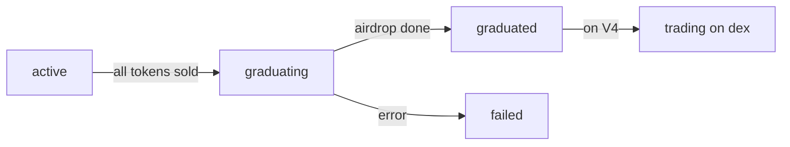

## What is Graduation?

**Graduation** is the automatic process where a successful token moves from the bonding curve to a Uniswap V4 liquidity pool. This provides:

- **Deeper liquidity** for larger trades
- **Unlimited price discovery** (no graduation cap)
- **Creator rewards** (20% of LP tokens)
- **Fee generation** for creators, platform, and LP holders
- **Permanent locked liquidity** (80% locked forever)

## When Does Graduation Happen?

Graduation triggers when **all tradeable tokens are sold**:

```
real_tokens == 0
```

At this point:
- All 793,100 tokens (79.31% of supply) have been purchased from the bonding curve
- The market cap has reached the graduation threshold
- The token is ready for the next phase

### Graduation Thresholds

| Network | Initial Mcap | Graduation Mcap | Real Tokens to Sell |
|---------|-------------|-----------------|---------------------|
| **Base Sepolia** | $6.90 | ~$69 | 793,100 (79.31%) |
| **Base** | $6,900 | ~$69,000 | 793,100 (79.31%) |

## The Graduation Process

Graduation is fully automatic and happens in 5 steps:

<Steps>
  <Step title="Detection">
    Background monitor checks every 30 seconds for tokens where `real_tokens == 0`.

    When detected, graduation process begins immediately.
  </Step>

  <Step title="Airdrop">
    **LP Reserve Distribution**: The 206,900 reserved tokens (20.69% of supply) are airdropped to existing holders proportionally.

    **Formula:**
    ```
    airdrop_amount = (your_tokens / total_distributed_tokens) × 206,900
    ```

    **Example:**
    - You own 10,000 tokens
    - Total distributed: 793,100 tokens
    - Your airdrop: `(10,000 / 793,100) × 206,900 ≈ 2,608 tokens`

    After airdrop:
    - You own: 12,608 tokens
    - Your % of supply: 1.26%
  </Step>

  <Step title="Pool Creation">
    **Two-Token System**: 402.cat uses a unique two-tier graduation:

    ### First Graduation: Platform Token (CAT)

    The very first token to graduate becomes the **platform token (CAT)**:
    - Creates CAT/USDC pool on Uniswap V4
    - Uses all accumulated `real_usdc` + 206,900 CAT tokens
    - Sets `platformTokenActive = true`
    - All future tokens pair against CAT

    ### Subsequent Graduations: Regular Tokens

    All tokens after CAT:
    1. **Swap USDC → CAT**: Convert accumulated `real_usdc` to CAT tokens
       - Uses the CAT/USDC pool
       - 50% slippage tolerance (testnet) for safety
    2. **Create Token/CAT pool**: New Uniswap V4 pool
    3. **Add liquidity**: Deposit CAT + LP reserve tokens
    4. **Lock LP position**: 80% locked forever, 20% to creator
  </Step>

  <Step title="LP Locking">
    **LP Position Management**:
    - 80% of LP tokens → Locked forever (burned or sent to locker contract)
    - 20% of LP tokens → Token creator (unlocked, can claim fees)

    **Creator Benefits:**
    - Earn fees on all trades (33% of hook fees)
    - Can increase liquidity position if desired
    - Cannot rug pull (80% locked permanently)
  </Step>

  <Step title="Hook Deployment">
    **Cat402Hook** is attached to the pool for automatic fee distribution:

    **Fee Structure:**
    - ~0.3% (30 basis points) per swap
    - Distributed: 33% creator / 33% platform / 33% LP holders
    - Collected automatically on every trade
    - Claimable via `claim_fees` endpoint
  </Step>
</Steps>

## Graduation States

Tokens progress through these states:



| State | Description |
|-------|-------------|
| `active` | Trading on bonding curve |
| `graduating` | Graduation in progress |
| `graduated` | Successfully graduated, trading on V4 |
| `failed` | Graduation failed (rare, requires admin intervention) |

## After Graduation

### Trading on Uniswap V4

Post-graduation, tokens trade exclusively on Uniswap V4:

- **Buy**: Swap USDC → CAT → Your Token
- **Sell**: Swap Your Token → CAT → USDC
- **No bonding curve**: Trades happen on the V4 pool only
- **Market price**: Determined by pool reserves (x*y=k)

### Fee Claiming

**Creators** can claim accumulated fees:

```bash
# View claimable fees
httpcat claim TOKEN_SYMBOL

# Execute claim
httpcat claim TOKEN_SYMBOL --execute
```

**API:**
```bash
# View fees
POST /entrypoints/view_fees/invoke
{
  "tokenId": "..."
}

# Claim fees
POST /entrypoints/claim_fees/invoke
{
  "tokenId": "..."
}
```

**Returns:**
```json
{
  "claimable": {
    "token0": "0.1234",
    "token1": "5.6789"
  },
  "claimableUsd": "12.34"
}
```

### LP Position Details

The graduated token has:

- **Pool ID**: Uniswap V4 pool identifier
- **Position ID**: NFT position identifier
- **Locked Amount**: 80% of LP tokens
- **Creator Amount**: 20% of LP tokens
- **Hook Address**: Cat402Hook contract address

Check via API:
```bash
GET /tokens/:id

# Returns graduation details:
{
  "v4Pool": {
    "poolId": "0x...",
    "positionId": "123",
    "lockerAddress": "0x...",
    "hookAddress": "0x..."
  }
}
```

## Graduation Economics

### For Holders

**Benefits:**
- **Airdrop**: Receive 20.69% more tokens
- **Liquidity**: Deeper pools for larger trades
- **Price Discovery**: No artificial caps
- **Fees**: Share of trading fees (33% to LPs)

**Considerations:**
- **Sell Pressure**: Some holders may sell after airdrop
- **Volatility**: Market-driven pricing (no curve protection)
- **Gas Costs**: Uniswap trades cost more gas than bonding curve

### For Creators

**Benefits:**
- **20% LP Position**: Ongoing fee generation
- **Legitimacy**: Graduated tokens are "proven"
- **Ownership**: Can manage LP position
- **Fees**: 33% of all trading fees

**Responsibilities:**
- **Community**: Build and maintain community
- **Marketing**: Drive trading volume for fees
- **Liquidity**: Optionally add more liquidity

### For Platform

**Benefits:**
- **33% of Fees**: Revenue from all graduated tokens
- **Platform Token**: CAT becomes valuable with more graduations
- **Network Effects**: More tokens → more CAT demand

## Graduation Monitoring

### Check Graduation Progress

Via CLI:
```bash
# Get token info
httpcat info TOKEN_SYMBOL

# Shows:
# Graduation Progress: 85.3% (676,612 / 793,100 tokens sold)
```

Via API:
```bash
GET /tokens/:id

# Returns:
{
  "graduationProgress": 0.853,
  "realTokens": "116488000000000000000000",
  "initialRealTokens": "793100000000000000000000"
}
```

### Graduation Logs

Track graduation process:

```sql
-- Database table: graduation_logs
SELECT * FROM graduation_logs WHERE token_id = '...';

-- Shows:
-- status: started, airdrop_success, liquidity_created, completed, failed
-- airdrop_tx_hash: 0x...
-- pool_creation_tx_hash: 0x...
-- lp_lock_tx_hash: 0x...
-- error_message: (if failed)
```

## Graduation Guarantees

### Automatic Execution

- **No manual intervention** required
- **Background monitoring** checks every 30 seconds
- **Atomic operations** prevent partial graduations
- **Error recovery** with admin fallback

### Price Continuity

The virtual reserve formula ensures smooth price transition:

```
bonding_curve_price ≈ v4_pool_price
```

No arbitrage opportunity at the graduation moment.

### Liquidity Guarantee

All accumulated `real_usdc` goes into the LP pool:

```
lp_liquidity_usdc = total_real_usdc
lp_liquidity_tokens = 206,900 (LP reserve)
```

Minimum liquidity is guaranteed.

## Edge Cases

<AccordionGroup>
  <Accordion title="What if graduation fails?" icon="triangle-exclamation">
    **Rare but possible scenarios:**

    - Network congestion
    - Gas price spike
    - Smart contract error

    **Recovery:**
    - Admin can manually trigger graduation
    - State rolls back to `active` if safe
    - Holders notified via events

    **Protection:**
    - Funds remain in bonding curve
    - No tokens are lost
    - Trading can resume
  </Accordion>

  <Accordion title="Can a token skip graduation?" icon="question">
    **No.** Once `real_tokens == 0`, graduation is automatic and cannot be skipped.

    However, creators can:
    - Buy tokens themselves to prevent graduation
    - Keep some tokens unbought indefinitely
    - Graduate when community is ready
  </Accordion>

  <Accordion title="What happens to ongoing trades during graduation?" icon="clock">
    **During graduation:**
    - New buys are rejected (token graduating)
    - Pending transactions may fail
    - Users are notified to retry after graduation

    **After graduation:**
    - Trades happen on Uniswap V4 only
    - Bonding curve is permanently disabled
  </Accordion>

  <Accordion title="Can you trade on both bonding curve and V4?" icon="split">
    **No.** Once graduated:
    - Bonding curve is disabled forever
    - All trades must go through Uniswap V4
    - No way to revert to bonding curve
  </Accordion>
</AccordionGroup>

## Platform Token (CAT)

The first graduated token becomes the **platform token**:

### CAT Token Purpose

1. **Pairing**: All tokens pair against CAT (not USDC)
2. **Value Accrual**: More graduations = more CAT demand
3. **Platform Revenue**: Fees generate CAT buy pressure
4. **Network Effect**: CAT becomes the ecosystem currency

### CAT Graduation Process

**Special considerations for the first token:**

1. **CAT/USDC Pool**: Created with all `real_usdc`
2. **No Token Swap**: No need to swap USDC → CAT
3. **Platform Activation**: Sets `platformTokenActive = true`
4. **Reference Pool**: All future tokens reference this pool for pricing

### After CAT Exists

All subsequent tokens:
- Swap accumulated USDC → CAT
- Create Token/CAT pool
- Users trade: USDC → CAT → Token (multi-hop)

## Next Steps

<CardGroup cols={2}>
  <Card
    title="Bonding Curve"
    icon="chart-area"
    href="/concepts/bonding-curve"
  >
    Understand pre-graduation mechanics
  </Card>
  <Card
    title="Fee Structure"
    icon="percent"
    href="/concepts/fees"
  >
    Learn about all fees in the system
  </Card>
  <Card
    title="Token Lifecycle"
    icon="repeat"
    href="/concepts/token-lifecycle"
  >
    Complete journey from creation to graduation
  </Card>
  <Card
    title="Claim Fees"
    icon="money-bill"
    href="/api-reference/fees/claim"
  >
    API documentation for claiming fees
  </Card>
</CardGroup>

<Tip>
Graduation is a one-way door. Once a token graduates, it can never return to the bonding curve. Plan accordingly!
</Tip>
