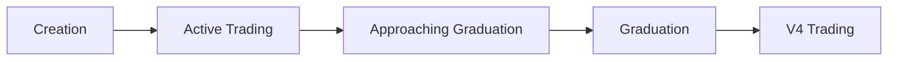

## Overview

Every token on 402.cat follows the same lifecycle: **Creation → Trading → Graduation**. Understanding this journey helps you make better decisions about when to create, buy, or sell.

## The Five Stages



---

## Stage 1: Creation

### Creating a Token

Anyone can create a token for **$0.01 USDC**:

```bash
httpcat create "Moon Cat" "MOON" --website https://mooncat.io
```

**What happens:**
1. **Smart contract deployed** with your parameters
2. **Initial state set**:
   - Total supply: 1,000,000 tokens
   - Real tokens: 793,100 (79.31% for trading)
   - LP reserve: 206,900 (20.69% for graduation)
   - Virtual reserves initialized
3. **Bonding curve activated**
4. **Token address assigned** (ends in `402`)

**Initial Conditions:**
- Market cap: $6.90 (testnet) or $6,900 (mainnet)
- Price: ~$0.0000069 (testnet)
- Status: `active`
- Available for trading immediately

<Tip>
Your token address ends in `402` for easy identification!
</Tip>

---

## Stage 2: Active Trading

### On the Bonding Curve

Tokens trade on the constant product bonding curve:

**Buying drives price up:**
- Users add USDC, receive tokens
- `real_tokens` decreases
- `virtual_usdc` increases
- Price increases automatically

**Selling drives price down:**
- Users return tokens, receive USDC
- `real_tokens` increases
- `virtual_usdc` decreases
- Price decreases automatically

**Key Metrics:**
- **Price**: Determined by virtual reserves (`virtual_usdc / virtual_tokens`)
- **Market Cap**: Price × total supply
- **Graduation Progress**: `(initial_real_tokens - real_tokens) / initial_real_tokens`
- **Liquidity**: All `real_usdc` available

### Trading Dynamics

**Early Stage** (0-25% graduation progress):
- Low price, high risk
- Small trades have minimal price impact
- Volatile - can reverse quickly
- Creator and early buyers accumulating

**Mid Stage** (25-75% graduation progress):
- Rising price if community is strong
- More holders, more liquidity
- Price impact becoming noticeable
- Community building momentum

**Late Stage** (75-100% graduation progress):
- Near graduation, high excitement
- Large trades have significant impact
- Last chance to buy on curve
- Airdrop anticipation

---

## Stage 3: Approaching Graduation

### The Final Push

As `real_tokens` approaches zero:

**At 90% Progress:**
- Only 79,310 tokens left (10% of original)
- Price has increased significantly
- Market cap approaching threshold
- Community excitement building

**At 99% Progress:**
- Only 7,931 tokens left (1% of original)
- Very high price
- Imminent graduation
- FOMO intensifies

**Trading Behavior Changes:**
- **Buyers**: Racing to get in before graduation
- **Sellers**: Some taking profits, others holding for airdrop
- **Price Impact**: Every trade moves the price noticeably
- **Volume**: Typically highest near graduation

### Graduation Trigger

When the last token is bought:
```
real_tokens == 0
```

Graduation process begins automatically within 30 seconds.

---

## Stage 4: Graduation

### Automatic Graduation Process

<Steps>
  <Step title="Detection">
    Background monitor detects `real_tokens == 0`
  </Step>

  <Step title="Status Change">
    Token status: `active` → `graduating`

    New buys rejected during this phase
  </Step>

  <Step title="Airdrop">
    **LP Reserve Distribution** (206,900 tokens):
    - Proportionally distributed to all holders
    - Based on your % of circulating supply
    - Example: 1% of supply → receive 2,069 airdrop tokens
  </Step>

  <Step title="LP Creation">
    **Uniswap V4 Pool**:
    - CAT/Token pair created
    - Liquidity added using `real_usdc` + LP tokens
    - 80% LP locked forever
    - 20% LP to creator
  </Step>

  <Step title="Completion">
    Token status: `graduating` → `graduated`

    Trading now happens on Uniswap V4 only
  </Step>
</Steps>

**Duration:** Typically 1-5 minutes depending on network conditions.

### What You Receive

**As a Holder:**
- ✅ Your original tokens (unchanged)
- ✅ Airdrop tokens (~26% more)
- ✅ LP fee share (33% of trading fees)

**As the Creator:**
- ✅ 20% of LP position (unlocked)
- ✅ 33% of all hook fees
- ✅ Ongoing revenue from trading

**Example:**
```
You bought: 10,000 tokens for $0.20
Circulating: 793,100 tokens
Your share: 1.26%

Airdrop: 10,000 × (206,900 / 793,100) = 2,608 tokens
New total: 12,608 tokens
Your % of supply: 1.26% (unchanged)
```

---

## Stage 5: V4 Trading

### Post-Graduation

**Trading Location:** Uniswap V4 only

**How to Trade:**
```bash
# CLI automatically detects graduated tokens
httpcat buy MOON 0.10   # Routes to V4
httpcat sell MOON 50%   # Routes to V4

# Or use Uniswap directly
# Swap USDC → CAT → MOON
```

**Fee Structure:**
- Hook fee: ~0.3%
- Creator: 33%
- Platform: 33%
- LPs: 33%

**Price Discovery:**
- Market-driven (no bonding curve)
- Deeper liquidity for larger trades
- Subject to normal DEX dynamics
- Influenced by overall market conditions

### Claiming Fees

**Creators:**
```bash
# View claimable fees
httpcat claim MOON

# Claim fees
httpcat claim MOON --execute
```

**LP Holders:**
- Fees accumulate in V4 position automatically
- Claim via Uniswap V4 interface
- Can compound by adding more liquidity

---

## Lifecycle Metrics

### Timeline

**Typical Successful Token:**
- **Day 1**: Creation, early trading (0-10% progress)
- **Day 2-7**: Community building (10-50% progress)
- **Week 2-4**: Momentum building (50-90% progress)
- **Final Push**: Last 10% → graduation

**Fast Movers:**
- Graduate in hours or days
- Strong marketing and community
- Often meme-driven or viral

**Slow Burners:**
- Take weeks or months
- Organic community growth
- Utility or long-term vision

### Success Indicators

**Likely to Graduate:**
- ✅ Steady buying pressure
- ✅ Growing holder count
- ✅ Active community/chat
- ✅ Creator engagement
- ✅ Consistent progress

**May Not Graduate:**
- ❌ No trading activity
- ❌ Single whale holder
- ❌ Creator abandoned
- ❌ Negative community sentiment
- ❌ Stalled progress

---

## State Transitions

| Current State | Trigger | Next State |
|--------------|---------|------------|
| Not created | `create_token` | `active` |
| `active` | `real_tokens == 0` | `graduating` |
| `graduating` | Airdrop complete | `graduated` |
| `graduating` | Error | `failed` (rare) |
| `graduated` | N/A | Permanent |
| `failed` | Admin fix | `active` or `graduated` |

**Permanent States:**
- `graduated`: Cannot return to bonding curve
- Token trades on V4 forever

---

## Best Practices by Stage

<AccordionGroup>
  <Accordion title="Creating (Stage 1)" icon="plus">
    **Do:**
    - Choose memorable name and symbol
    - Add website/social links
    - Plan marketing strategy
    - Set realistic expectations

    **Don't:**
    - Create without a plan
    - Copy existing successful tokens
    - Abandon after creation
  </Accordion>

  <Accordion title="Active Trading (Stage 2)" icon="chart-line">
    **Do:**
    - Build community
    - Engage in chat
    - Share updates
    - Monitor progress

    **Don't:**
    - Dump on buyers
    - Make unrealistic promises
    - Ignore community
  </Accordion>

  <Accordion title="Near Graduation (Stage 3)" icon="flag-checkered">
    **Do:**
    - Communicate timeline
    - Prepare for V4 listing
    - Celebrate milestones
    - Plan post-graduation strategy

    **Don't:**
    - Cause panic selling
    - Overhype airdrop
    - Disappear before graduation
  </Accordion>

  <Accordion title="Post-Graduation (Stage 5)" icon="rocket">
    **Do:**
    - Continue community engagement
    - Add more V4 liquidity if desired
    - Claim and reinvest fees
    - Long-term vision

    **Don't:**
    - Abandon after graduation
    - Dump LP tokens immediately
    - Ignore ongoing community
  </Accordion>
</AccordionGroup>

---

## Next Steps

<CardGroup cols={2}>
  <Card
    title="Bonding Curve"
    icon="chart-area"
    href="/concepts/bonding-curve"
  >
    Deep dive into pricing mechanics
  </Card>
  <Card
    title="Graduation"
    icon="graduation-cap"
    href="/concepts/graduation"
  >
    Complete graduation documentation
  </Card>
  <Card
    title="Fee Structure"
    icon="percent"
    href="/concepts/fees"
  >
    Understand all fees
  </Card>
  <Card
    title="Quick Start"
    icon="bolt"
    href="/quickstart"
  >
    Create your first token
  </Card>
</CardGroup>

<Tip>
The best tokens balance fair distribution (many holders), community engagement, and steady graduation progress. Quality over hype wins long-term.
</Tip>
