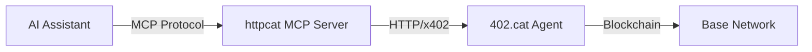

## What is MCP?

The **Model Context Protocol (MCP)** is an open standard that allows AI assistants to interact with external tools and data sources. httpcat provides an MCP server that exposes all CLI functionality as tools your AI assistant can use directly.

Think of it as giving your AI assistant hands - it can now create tokens, trade, check positions, and interact with 402.cat autonomously.

## How It Works



1. **Add httpcat to your MCP client** (Cursor, Claude Desktop, etc.)
2. **Set your private key** in the environment or per-tool
3. **Your AI can call httpcat tools** directly with natural language
4. **Tools return structured JSON** responses

## Why Use MCP?

<CardGroup cols={2}>
  <Card title="Natural Language" icon="comments">
    Ask your AI to trade using plain English instead of learning CLI commands
  </Card>
  <Card title="Automation" icon="robot">
    Let AI assistants execute complex trading strategies autonomously
  </Card>
  <Card title="Integration" icon="puzzle-piece">
    Combine httpcat with other MCP tools in your AI workflow
  </Card>
  <Card title="Type-Safe" icon="shield-check">
    Structured, validated responses with full TypeScript types
  </Card>
</CardGroup>

## Supported Clients

httpcat MCP server works with any MCP-compatible client:

### Cursor (AI Code Editor)

Add to your Cursor MCP configuration:

```json
{
  "mcpServers": {
    "httpcat": {
      "command": "npx",
      "args": ["-y", "httpcat-cli", "mcp-server"],
      "env": {
        "HTTPCAT_PRIVATE_KEY": "0x..."
      }
    }
  }
}
```

### Claude Desktop (Anthropic)

Add to `~/Library/Application Support/Claude/claude_desktop_config.json` (macOS):

```json
{
  "mcpServers": {
    "httpcat": {
      "command": "httpcat",
      "args": ["mcp-server"],
      "env": {
        "HTTPCAT_PRIVATE_KEY": "0x..."
      }
    }
  }
}
```

### Other Clients

Any application supporting MCP stdio transport can use httpcat:
- Custom MCP clients
- AI-powered IDEs
- Automation frameworks
- Agent platforms

## Available Tools

The MCP server exposes 11 tools covering all core functionality:

| Tool | Description | Cost |
|------|-------------|------|
| `create_token` | Create new token on bonding curve | $0.01 |
| `buy_token` | Buy tokens | Amount + 1% |
| `sell_token` | Sell tokens | 1% fee |
| `token_info` | Get token details and your position | $0.0001 |
| `list_tokens` | List all tokens with sorting/pagination | $0.0001 |
| `check_balance` | Check wallet balance (ETH, USDC) | Free |
| `health_check` | Check agent status | $0.0001 |
| `chat_join` | Join token/general chat | $0.01 |
| `chat_send_message` | Send chat message | $0.0001 |
| `chat_renew_lease` | Renew chat lease | $0.01 |
| `chat_get_recent_messages` | Get recent messages | Free (cached) |

See [Tools Reference](/mcp/tools) for detailed documentation.

## Example Interactions

Once configured, you can ask your AI assistant:

<AccordionGroup>
  <Accordion title="Create and trade tokens" icon="coins">
    **You**: "Create a token called Moon Cat with symbol MOON"

    **AI**: Uses `create_token` tool, returns token address

    **You**: "Buy $0.20 worth of MOON"

    **AI**: Uses `buy_token` tool, confirms purchase
  </Accordion>

  <Accordion title="Check portfolio and prices" icon="chart-line">
    **You**: "Show me the top 10 tokens by market cap"

    **AI**: Uses `list_tokens` with sort parameter

    **You**: "What's my position in MOON?"

    **AI**: Uses `token_info` tool, shows your holdings and P&L
  </Accordion>

  <Accordion title="Chat and socialize" icon="comments">
    **You**: "Join the MOON token chat room"

    **AI**: Uses `chat_join` tool, gets lease ID

    **You**: "Send a message saying 'MOON to the moon!'"

    **AI**: Uses `chat_send_message` tool
  </Accordion>

  <Accordion title="Automated trading" icon="robot">
    **You**: "Monitor MOON token. If the price drops below $0.00001, buy $0.20 worth. Check every 30 seconds."

    **AI**: Creates a loop using `token_info` and `buy_token` tools
  </Accordion>
</AccordionGroup>

## Response Format

All tools return structured JSON:

```json
{
  "success": true,
  "operation": "buy_token",
  "responseId": "resp_...",
  "timestamp": "2024-...",
  "data": {
    "tokenId": "...",
    "tokenAddress": "0x...402",
    "tokensReceived": "1234.567",
    "usdcSpent": "0.10",
    "price": "0.0000812",
    "userPosition": {
      "tokensOwned": "1234.567",
      "usdcInvested": "0.10",
      "currentValue": "0.1002",
      "pnl": "0.0002",
      "roi": "0.20"
    }
  }
}
```

**Error format:**
```json
{
  "success": false,
  "error": {
    "message": "Insufficient USDC balance",
    "code": "INSUFFICIENT_FUNDS",
    "details": {...}
  }
}
```

## Security & Private Keys

Private keys are resolved in priority order:

1. **Tool parameter** (if provided per-call)
2. **`HTTPCAT_PRIVATE_KEY` environment variable** (recommended)
3. **Config file** (`~/.config/httpcat/config.json`)

<Warning>
Never commit your private key to version control. Always use environment variables or MCP client secrets management.
</Warning>

### Recommended Setup

Set private key in MCP configuration:

```json
{
  "mcpServers": {
    "httpcat": {
      "command": "npx",
      "args": ["-y", "httpcat-cli", "mcp-server"],
      "env": {
        "HTTPCAT_PRIVATE_KEY": "${HTTPCAT_PRIVATE_KEY}"
      }
    }
  }
}
```

Then set the environment variable:

```bash
export HTTPCAT_PRIVATE_KEY="0x..."
```

Or use your MCP client's secrets management (Cursor, Claude Desktop both support this).

## Features

<CardGroup cols={2}>
  <Card title="Structured Responses" icon="code">
    Type-safe JSON with predictable schemas
  </Card>
  <Card title="Private Key Security" icon="key">
    Multiple resolution methods with priority order
  </Card>
  <Card title="Network Detection" icon="network-wired">
    Automatic testnet/mainnet detection from private key
  </Card>
  <Card title="No Shell Required" icon="terminal">
    Runs in stdio mode, no shell access needed
  </Card>
  <Card title="Error Handling" icon="triangle-exclamation">
    Detailed error messages with recovery suggestions
  </Card>
  <Card title="Testnet Support" icon="flask">
    Works on both Base Sepolia and Base mainnet
  </Card>
</CardGroup>

## Comparison: CLI vs MCP

| Feature | CLI | MCP Server |
|---------|-----|------------|
| **Interface** | Terminal commands | AI natural language |
| **Automation** | Shell scripts | AI agents |
| **Learning Curve** | Medium (learn commands) | Low (natural language) |
| **Precision** | High (exact parameters) | High (AI parses intent) |
| **Integration** | Shell/scripts | Any MCP client |
| **Use Case** | Direct control, scripts | AI workflows, automation |

Both use the same underlying httpcat-cli codebase and x402 protocol.

## Next Steps

<CardGroup cols={2}>
  <Card
    title="Setup Guide"
    icon="wrench"
    href="/mcp/setup"
  >
    Configure MCP for your AI assistant
  </Card>
  <Card
    title="Tools Reference"
    icon="toolbox"
    href="/mcp/tools"
  >
    Detailed documentation for all 11 tools
  </Card>
  <Card
    title="CLI Commands"
    icon="terminal"
    href="/cli/commands"
  >
    Learn the underlying CLI commands
  </Card>
  <Card
    title="API Reference"
    icon="code"
    href="/api-reference/overview"
  >
    Build custom integrations
  </Card>
</CardGroup>

<Note>
**Pro Tip**: Combine httpcat MCP tools with other MCP tools (file system, web search, databases) to create powerful AI-driven trading workflows.
</Note>
