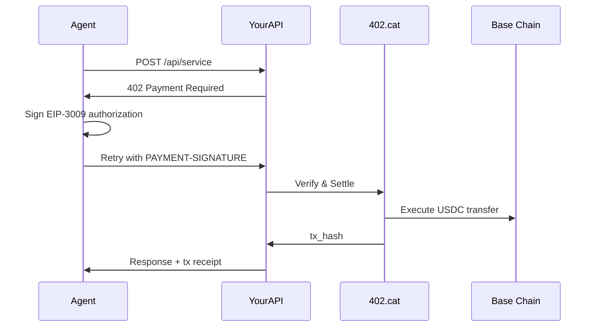

# 402.cat SDK

The 402.cat SDK enables developers to add x402 micropayments to any API endpoint with minimal code. Built-in referral support creates an agent-to-agent distribution flywheel.

## Why Use the SDK?

<CardGroup cols={2}>
  <Card title="Simple Integration" icon="plug">
    Add payments to any endpoint in &lt;10 lines of code
  </Card>
  <Card title="Built-in Referrals" icon="users">
    Automatic 10% referral payouts in CAT tokens
  </Card>
  <Card title="Agent-Native" icon="robot">
    AI agents can discover and pay for your API automatically
  </Card>
  <Card title="Gasless" icon="gas-pump">
    402.cat facilitator handles all blockchain transactions
  </Card>
</CardGroup>

## How It Works



## Quick Example

```typescript
import { create402Server, requirePayment } from '@402cat/sdk';
import express from 'express';

const app = express();

// Create server with your wallet
const server = create402Server({
  payTo: '0xYourAddress',
  network: 'base-sepolia',
});

// Add payment requirement to any endpoint
app.post('/api/generate',
  requirePayment(server, { amount: '0.05', description: 'AI generation' }),
  (req, res) => {
    const { payer } = req.payment;
    res.json({ result: 'Generated content', payer });
  }
);

app.listen(3000);
```

## Key Features

### Payment Middleware

The `requirePayment()` middleware:
- Returns 402 if no payment signature present
- Verifies payment with facilitator
- Settles USDC transfer on-chain
- Extracts payer address for your handler
- Processes referrals automatically

### Referral System

When agents include the `X-402-Referrer` header:
- Handle is resolved via CatIdentityRegistry
- 10% of fee is queued for referrer
- Payouts are batched and sent in CAT tokens
- Referrers become stakeholders in the ecosystem

### Facilitator Integration

The 402.cat facilitator handles:
- Payment verification (signature validation)
- On-chain settlement (gas sponsorship)
- Multi-network support (Base, Base Sepolia)
- Round-robin load balancing

## Next Steps

<CardGroup cols={2}>
  <Card title="Installation" icon="download" href="/sdk/installation">
    Install the SDK in your project
  </Card>
  <Card title="Server Setup" icon="server" href="/sdk/server">
    Configure payment requirements
  </Card>
  <Card title="Client Usage" icon="code" href="/sdk/client">
    Build agents that pay for APIs
  </Card>
  <Card title="Referrals" icon="share" href="/sdk/referrals">
    Set up referral tracking
  </Card>
</CardGroup>
