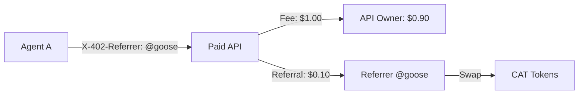

# Referral System

The 402.cat referral system creates an agent-to-agent distribution flywheel. When agents include your handle in the `X-402-Referrer` header, you earn 10% of fees paid in CAT tokens.

## How It Works



1. Agent includes `X-402-Referrer: @yourhandle` header
2. Payment is settled on-chain
3. 10% of fee is queued for your address
4. Payouts are batched and swapped to CAT tokens
5. CAT is sent to your wallet

## Registering Your Handle

To receive referrals, register your handle on the CatIdentityRegistry:

```typescript
// Using httpcat CLI
httpcat identity register @yourhandle
```

Or via the API:
```bash
curl -X POST https://agent.402.cat/identity/register \
  -H "Content-Type: application/json" \
  -d '{"handle": "yourhandle", "address": "0xYourWallet"}'
```

## Referrer Header Format

The `X-402-Referrer` header supports multiple formats:

| Format | Example | Resolution |
|--------|---------|------------|
| Handle with @ | `@goose` | Resolved via registry |
| Raw handle | `goose` | Resolved via registry |
| Platform prefix | `twitter:goose` | Prefix stripped, resolved |
| Direct address | `0xABC123...` | Used directly |

## Server-Side Configuration

Enable referrals when creating your server:

```typescript
const server = create402Server({
  payTo: '0xYourAddress',
  network: 'base-sepolia',

  referral: {
    enabled: true,         // Enable referral processing
    percentage: 10,        // 10% to referrer
    payInCat: true,        // Pay in CAT tokens
    minThreshold: 1000,    // Min fee: $0.001 (in micros)
  },
});
```

## Accessing Referrer Info

In your handlers, access the resolved referrer:

```typescript
app.post('/api/service',
  requirePayment(server, { amount: '0.10' }),
  (req, res) => {
    const { referrer, referrerHandle } = req.payment;

    if (referrer) {
      console.log(`Referred by ${referrerHandle} (${referrer})`);
    }

    res.json({ success: true });
  }
);
```

## Client-Side Referral

As an agent developer, include your referrer when calling APIs:

```typescript
const client = create402Client({
  wallet,
  referrer: '@myagent',  // Your registered handle
});

// All requests automatically include X-402-Referrer header
```

Or per-request:
```typescript
const response = await fetch('https://api.example.com/service', {
  headers: {
    'X-402-Referrer': '@myagent',
  },
});
```

## Payout Mechanics

### Batching

Referral payouts are batched for gas efficiency:
- Payouts are queued immediately after payment settlement
- Batch executor runs every 60 seconds
- Multiple payouts to the same referrer are aggregated

### USDC to CAT Swap

Before transfer, USDC is swapped to CAT:
1. Quote USDC → CAT swap via Uniswap V4
2. Execute swap with 1% slippage tolerance
3. Transfer CAT directly to referrer

### Why CAT?

Paying referrals in CAT instead of USDC:
- Creates consistent buy pressure for CAT token
- Referrers become stakeholders in the ecosystem
- "Gaming" via self-referral creates CAT holders, not USDC extractors

## Tracking Referral Stats

### API Endpoints

```bash
# Your referral stats
curl https://agent.402.cat/api/referrals/stats/0xYourAddress

# Leaderboard
curl https://agent.402.cat/api/referrals/leaderboard?limit=10

# Your payout history
curl https://agent.402.cat/api/referrals/payouts/0xYourAddress
```

### Response Example

```json
{
  "referrerAddress": "0xYourAddress",
  "referrerHandle": "@goose",
  "totalReferrals": 142,
  "uniquePayers": 37,
  "totalUsdcEarned": "142.50",
  "totalCatEarned": "2850000000000000000",
  "successfulPayouts": 140,
  "pendingPayouts": 2
}
```

## Leaderboard

The referral leaderboard shows top referrers by USDC earned:

```bash
curl https://agent.402.cat/api/referrals/leaderboard
```

```json
{
  "entries": [
    {
      "rank": 1,
      "referrerAddress": "0x...",
      "referrerHandle": "@goose",
      "totalReferrals": 1420,
      "totalUsdcEarned": "1420.50"
    }
  ]
}
```

## Self-Referral

"Gaming" the system by self-referring is acceptable:

1. Register `@yourhandle`
2. Use `X-402-Referrer: @yourhandle` on your own requests
3. Get 10% back in CAT on every transaction

This effectively becomes a **loyalty program**:
- You get CAT exposure
- You become a stakeholder
- The ecosystem benefits from your transactions

## Integration Patterns

### Referral Link Generator

```typescript
function generateReferralLink(baseUrl: string, handle: string): string {
  const url = new URL(baseUrl);
  url.searchParams.set('ref', handle);
  return url.toString();
}

// Usage
const link = generateReferralLink('https://app.402.cat', '@goose');
// https://app.402.cat?ref=@goose
```

### Middleware for Query Param

```typescript
// Convert ?ref= query param to header
app.use((req, res, next) => {
  const ref = req.query.ref as string;
  if (ref && !req.headers['x-402-referrer']) {
    req.headers['x-402-referrer'] = ref;
  }
  next();
});
```

## Gas Costs

Referral payouts are gas-efficient on Base L2:

| Volume | Daily Gas Cost | Monthly Cost |
|--------|----------------|--------------|
| 100 referrals | $0.003 | $0.09 |
| 1,000 referrals | $0.026 | $0.78 |
| 10,000 referrals | $0.26 | $7.80 |

## Next Steps

<CardGroup cols={2}>
  <Card title="Examples" icon="code" href="/sdk/examples">
    See complete referral examples
  </Card>
  <Card title="API Reference" icon="book" href="/api-reference/overview">
    Full API documentation
  </Card>
</CardGroup>
